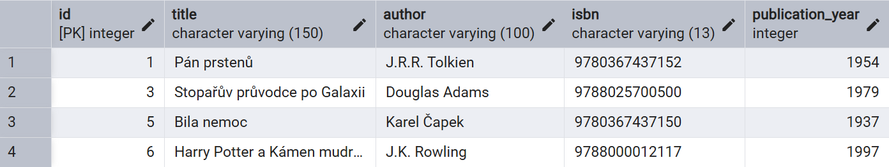

## 1. Úvod do relačního modelu a PostgreSQL

V této úvodní části se seznámíme se základními pojmy ze světa databází, zaměříme se na principy relačního datového modelu a představíme si databázový systém PostgreSQL, který budeme v kurzu používat.

### Co je to databáze a DBMS?

* **Databáze (Database):** Představte si ji jako organizovanou sbírku dat uloženou elektronicky. Jejím účelem je efektivní ukládání, správa a zpřístupňování informací. Může obsahovat data nejrůznějšího charakteru – od seznamu zákazníků přes informace o produktech až po vědecká data.
* **Systém Řízení Báze Dat (SŘBD) / Database Management System (DBMS):** Je to software, který slouží jako rozhraní mezi uživatelem (nebo aplikací) a samotnou databází. DBMS umožňuje data definovat (strukturu), manipulovat s nimi (vkládat, měnit, mazat) a dotazovat se na ně. Zajišťuje také bezpečnost, integritu dat, souběžný přístup více uživatelů a obnovu po selhání.
    * Příklady DBMS: PostgreSQL, MySQL, Oracle Database, Microsoft SQL Server, SQLite, MariaDB.
* **Relační DBMS (RDBMS):** Speciální typ DBMS založený na relačním modelu (viz níže). PostgreSQL je příkladem RDBMS (konkrétně objektově-relačního ORDBMS).

### Transakce a ACID vlastnosti

Většina operací s databází (zejména v reálných aplikacích) se neprovádí izolovaně, ale jako součást **databázové transakce**.

* **Transakce:** Je to posloupnost jedné nebo více databázových operací (např. `INSERT`, `UPDATE`, `DELETE`), která je považována za **jednu nedělitelnou (atomickou) logickou jednotku práce**. Cílem je zajistit, že se buď **všechny** operace v rámci transakce úspěšně provedou a jejich výsledky se trvale uloží, nebo se **žádná** z nich neprovede (a databáze zůstane ve stavu, v jakém byla před začátkem transakce). Typickým příkladem je bankovní převod: odečtení peněz z jednoho účtu a přičtení na druhý musí proběhnout buď obojí, nebo nic.

Spolehlivost transakcí v relačních databázích je zaručena dodržováním tzv. **ACID** vlastností:

* **A - Atomicita (Atomicity):** "Všechno, nebo nic". Transakce je nedělitelná. Pokud jakákoli část transakce selže (kvůli chybě, výpadku systému atd.), celá transakce je **vrácena zpět (rollback)** a databáze se vrátí do stavu před jejím zahájením. Pokud všechny operace uspějí, transakce je **potvrzena (commit)** a změny jsou trvale uloženy.
* **C - Konzistence (Consistency):** Transakce převádí databázi z jednoho **validního (konzistentního) stavu** do jiného validního stavu. To znamená, že transakce musí vždy zachovávat definovaná databázová pravidla a omezení (integritní omezení jako primární klíče, cizí klíče, `NOT NULL`, `UNIQUE`, `CHECK`). Pokud by transakce měla za následek porušení těchto pravidel, nebude povolena (nebo bude vrácena zpět).
* **I - Izolace (Isolation):** Transakce probíhající souběžně (ve stejný čas) se navzájem neovlivňují. Každá transakce "vidí" databázi tak, jako by běžela sama, bez ohledu na ostatní nedokončené transakce. Výsledek souběžného zpracování více transakcí musí být stejný, jako kdyby byly provedeny postupně jedna po druhé v nějakém pořadí. (Existují různé *úrovně izolace*, které definují, jak striktně je toto pravidlo vynucováno, což má vliv na výkon.)
* **D - Trvanlivost (Durability):** Jakmile je transakce úspěšně potvrzena (`COMMIT`), její výsledky jsou **trvale uloženy** a "přežijí" i případné selhání systému (např. výpadek napájení, pád serveru). Změny jsou zapsány na perzistentní úložiště (typicky pevný disk).

Dodržování ACID vlastností je klíčovým rysem většiny RDBMS, včetně PostgreSQL, a zajišťuje spolehlivost a integritu dat i ve složitých systémech s mnoha souběžnými uživateli.

### Relační datový model

Relační model, poprvé formálně popsán Edgarem F. Coddem v roce 1970, je nejpoužívanějším modelem pro strukturování dat v databázích. Jeho hlavní myšlenkou je organizace dat do **tabulek**.

* **Tabulka (Table / Relation):** Základní stavební kámen. Reprezentuje určitý typ entity (např. Studenti, Knihy, Objednávky). Skládá se z řádků a sloupců.
    
* **Řádek (Row / Tuple / Record):** Reprezentuje jeden konkrétní záznam nebo instanci entity v tabulce (např. jedna konkrétní kniha, jeden student).
* **Sloupec (Column / Attribute):** Reprezentuje určitou vlastnost nebo atribut entity (např. Název knihy, Jméno studenta, Cena produktu). Každý sloupec má definovaný **datový typ**.
* **Datový typ (Data Type):** Určuje, jaký druh dat může sloupec obsahovat a jaké operace s nimi lze provádět. Mezi běžné typy patří:
    * `INTEGER` nebo `INT`: Celá čísla.
    * `VARCHAR(n)`: Textový řetězec s proměnnou délkou (maximálně `n` znaků).
    * `TEXT`: Dlouhý textový řetězec bez pevného omezení délky.
    * `DATE`: Datum (rok, měsíc, den).
    * `TIMESTAMP`: Datum a čas.
    * `BOOLEAN`: Logická hodnota (pravda/nepravda, `TRUE`/`FALSE`).
    * `NUMERIC(p, s)` nebo `DECIMAL(p, s)`: Číslo s pevnou desetinnou čárkou (přesnost `p`, počet desetinných míst `s`).
    * `FLOAT`, `REAL`: Čísla s plovoucí desetinnou čárkou.
* **Hodnota NULL:** Speciální hodnota, která značí, že data ve sloupci pro daný řádek chybí nebo nejsou známa/použitelná. Není to totéž co nula nebo prázdný řetězec.

### Klíče a Vztahy

Klíče jsou zásadní pro zajištění integrity a propojení dat v relační databázi.

* **Primární klíč (Primary Key - PK):** Jeden nebo více sloupců, jejichž hodnota **jednoznačně identifikuje každý řádek** v tabulce. Hodnoty v PK sloupci(ích) musí být unikátní a nesmí být `NULL`. Každá tabulka by měla mít právě jeden primární klíč. Často se jako PK používá uměle vytvořený celočíselný sloupec (např. `id`) s automatickým navyšováním (auto-increment).
* **Cizí klíč (Foreign Key - FK):** Jeden nebo více sloupců v jedné tabulce, které odkazují na primární klíč v jiné (nebo téže) tabulce. Cizí klíče vytvářejí **vztahy (relationships)** mezi tabulkami a zajišťují **referenční integritu** – databáze hlídá, aby FK odkazoval na existující řádek v referencované tabulce (např. nelze vložit výpůjčku knihy, která neexistuje v tabulce knih).
* **Vztahy:** Pomocí cizích klíčů modelujeme vztahy mezi entitami:
    * **1:N (One-to-Many):** Jeden záznam v jedné tabulce může souviset s více záznamy v druhé tabulce (např. jeden vydavatel vydá mnoho knih). Realizuje se přidáním FK do tabulky na straně "N" (v tabulce `books` bude sloupec `publisher_id` odkazující na PK v tabulce `publishers`).
    * **M:N (Many-to-Many):** Jeden záznam v první tabulce může souviset s více záznamy ve druhé a naopak (např. jedna kniha může mít více autorů a jeden autor může napsat více knih). Realizuje se pomocí **asociační (vazební) tabulky**, která obsahuje cizí klíče na obě propojované tabulky (např. tabulka `book_authors` s `book_id` a `author_id`).
    * **1:1 (One-to-One):** Jeden záznam v jedné tabulce souvisí právě s jedním záznamem v druhé (méně časté, např. oddělení volitelných detailů o uživateli do samostatné tabulky). Lze realizovat unikátním FK.

### Normalizace databáze

Při návrhu schématu relační databáze je důležitým konceptem **normalizace**. Je to proces organizace dat v tabulkách tak, aby se **minimalizovala redundance (nadbytečnost) dat** a **zlepšila datová integrita**. Cílem je zajistit, aby každá informace byla uložena právě na jednom místě (pokud je to možné a smysluplné) a aby se předešlo problémům známým jako **anomálie**:

* **Anomálie při vkládání (Insertion Anomaly):** Neschopnost vložit data o jedné entitě bez nutnosti vložit data o jiné (např. nemůžeme vložit informace o novém vydavateli, dokud nevydá alespoň jednu knihu, pokud jsou informace o vydavateli přímo v tabulce knih).
* **Anomálie při mazání (Deletion Anomaly):** Nechtěná ztráta dat při mazání jiných dat (např. pokud smažeme poslední knihu od nějakého vydavatele, ztratíme i informace o tomto vydavateli, pokud jsou uloženy jen v tabulce knih).
* **Anomálie při aktualizaci (Update Anomaly):** Nutnost změnit stejnou informaci na více místech, což zvyšuje riziko nekonzistence (např. pokud se změní sídlo vydavatele, museli bychom ho změnit u všech knih tohoto vydavatele, pokud by bylo sídlo uloženo v tabulce knih).

Normalizace se provádí postupným převáděním schématu do tzv. **normálních forem (Normal Forms - NF)**. Základní normální formy jsou:

* **První normální forma (1NF):**
    * Všechny hodnoty v buňkách tabulky jsou **atomické** (nedělitelné) - žádné seznamy nebo složené hodnoty v jedné buňce.
    * Každý řádek je unikátní (zajištěno primárním klíčem).
    * Neobsahuje opakující se skupiny sloupců (např. sloupce `autor1`, `autor2`, `autor3`).
    * *Příklad porušení: Sloupec `autori` obsahující text 'Tolkien, Lewis'. Řešení: Samostatná tabulka autorů a vazební tabulka.*
* **Druhá normální forma (2NF):**
    * Tabulka musí být v 1NF.
    * Všechny **neklíčové atributy** (sloupce, které nejsou součástí primárního klíče) musí být **plně funkčně závislé na celém primárním klíči**.
    * Toto pravidlo je relevantní hlavně u tabulek se **složeným primárním klíčem** (PK z více sloupců). Znamená to, že žádný neklíčový atribut nesmí záviset pouze na části složeného PK.
    * *Příklad porušení: Tabulka `objednavka_polozky(objednavka_id, produkt_id, nazev_produktu, mnozstvi)`. PK je (`objednavka_id`, `produkt_id`). `nazev_produktu` závisí pouze na `produkt_id` (část PK), ne na celém PK. Řešení: Oddělit `nazev_produktu` do tabulky `produkty`.*
* **Třetí normální forma (3NF):**
    * Tabulka musí být v 2NF.
    * Žádný **neklíčový atribut** nesmí být **tranzitivně závislý** na primárním klíči. To znamená, že žádný neklíčový atribut nesmí záviset na jiném neklíčovém atributu.
    * *Příklad porušení: Tabulka `knihy(book_id, title, publisher_id, publisher_headquarters)`. PK je `book_id`. `publisher_headquarters` závisí na `publisher_id` (což je neklíčový atribut), který závisí na `book_id`. Jde o tranzitivní závislost. Řešení: Oddělit `publisher_headquarters` do tabulky `publishers`, kde PK je `publisher_id`.*

Existují i vyšší normální formy (BCNF, 4NF, 5NF), ale pro většinu praktických aplikací je dosažení **3NF** dostatečným cílem. Naše schéma knihovny (s tabulkami `publishers`, `authors`, `books`, `book_authors`) je navrženo tak, aby bylo přibližně ve 3NF.

**Normalizace vs. Výkon:** Vysoká míra normalizace snižuje redundanci a zlepšuje integritu, ale může vést k potřebě spojovat více tabulek (`JOIN`) při dotazování, což může někdy snižovat výkon. V praxi se proto někdy přistupuje k řízené **denormalizaci** (záměrnému porušení některé NF) pro optimalizaci výkonu čtení, ale za cenu zvýšené redundance a složitější údržby konzistence.

### Představení PostgreSQL

**PostgreSQL** (často zkracováno jako "Postgres") je vysoce výkonný, stabilní a rozšiřitelný **objektově-relační databázový systém (ORDBMS)** s otevřeným zdrojovým kódem. Patří mezi nejpokročilejší open-source databáze a těší se velké popularitě.

**Klíčové vlastnosti PostgreSQL:**

* **ACID Kompliance:** Zaručuje spolehlivost transakcí (viz výše).
* **MVCC (Multi-Version Concurrency Control):** Efektivní správa souběžného přístupu více uživatelů k datům bez nutnosti zamykání celých tabulek.
* **Rozšiřitelnost:** Umožňuje definovat vlastní datové typy, funkce, operátory, indexovací metody.
* **Široká škála datových typů:** Podporuje nejen standardní SQL typy, ale i pokročilé jako JSON/JSONB, pole (arrays), geometrické typy (díky rozšíření PostGIS), UUID a další.
* **Pokročilé funkce SQL:** Podpora pro оstatní funkce (window functions), CTE (Common Table Expressions), rekurzivní dotazy.
* **Procedurální jazyky:** Možnost psát uložené procedury a funkce v různých jazycích (PL/pgSQL, PL/Python, PL/Perl, atd.).
* **Robustnost a spolehlivost:** Vhodný pro kritické aplikace a velké objemy dat.
* **Aktivní komunita a vývoj.**

V tomto kurzu budeme PostgreSQL používat jako platformu pro všechny naše praktické SQL ukázky.

### Připojení k PostgreSQL

Jak je uvedeno v sekci "Nastavení prostředí", budeme používat PostgreSQL běžící v Docker kontejneru. Pro připojení k této databázi můžeme použít:

* **pgAdmin:** Webový nástroj běžící v samostatném Docker kontejneru (dostupný na [http://localhost:5050](http://localhost:5050)). Po přihlášení do pgAdminu je třeba nakonfigurovat připojení k databázovému serveru `db` (název služby v Dockeru) na portu `5432` s použitím přihlašovacích údajů definovaných v `docker-compose.yml`.
* **Jiní SQL klienti (DBeaver, [SQLTools](https://marketplace.visualstudio.com/items/?itemName=mtxr.sqltools) ve VS Code, psql):** Tyto nástroje se připojují přímo na port mapovaný na vašem hostitelském počítači (typicky `localhost:5433`) s použitím stejných přihlašovacích údajů.

V následujících částech začneme používat jazyk SQL pro práci s naší databází knihovny v PostgreSQL.
